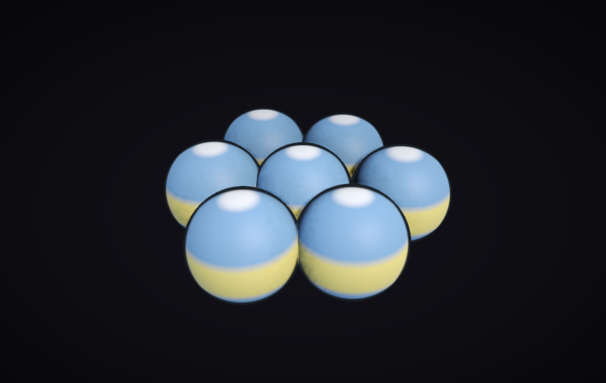

# LAMMPS live

An MD simulation you can grab with your hands. It's real LAMMPS running under a
60 fps game loop, and you drive it with a force feedback joystick, so you
actually feel what the model pushes back with.



Those seven balls are MesoMem beads, the coarse grained membrane model from the
Idema group. It's their actual LAMMPS pair style
([arXiv:2602.24123](https://arxiv.org/abs/2602.24123)) compiled in, not my
approximation of it. Every bead carries a director, which is what the
yellow/blue banding shows, and basically everything the model does (membranes
staying flat, healing, assembling themselves out of a random soup) comes from
those directors wanting to line up with their neighbours.

## What it's for

In the paper membrane elasticity is a handful of numbers. A tilt modulus, a
splay modulus, a transition somewhere around `k_tilt ~ 10`. Here you can just
grab the thing and find out what those numbers feel like.

- **Feel it.** Pull a bead out of the sheet and the membrane resists in your
  hand. The stick is limp when nothing is holding you and gets firm on contact,
  and it buzzes more when you turn the temperature up. Twist hard enough and the
  director flips over to the other normal, because the tilt term has two minima.
  That's not an effect I added, it's the force field.
- **Turn the knobs while it runs.** Every coefficient is a live slider. Take
  `k_tilt` down through the transition and the same run stops making membranes
  and starts making blobs.
- **Watch it build itself.** 1500 beads dropped in at random, coarsening into
  flat lamellae in front of you, in about a minute.

Mostly it's a demo you give standing up, and a way to get an intuition for a
model whose parameters otherwise stay pretty abstract.

## Scenes

| | |
|---|---|
| `mesomem_patch` | seven beads. Pull the middle one out and feel tilt and splay resist |
| `mesomem_sheet` | ~900 beads, periodic, so a piece of an endless membrane. Watch a deformation spread |
| `mesomem_assembly` | 1500 beads from a random start, assembling. Play / Pause / Reset |
| `mesomem_rod` | 3600 beads at constant tension, seen in section. Steer a rod-shaped "bacterium" in and watch the membrane invaginate it |
| `mesomem_remote` | same thing at 10,000 beads, running on a cluster A100 |
| `mesomem_polymer` | a closed vesicle with 32,000 beads of ring polymer sealed inside, on the same A100. Slice it open with the thrust lever to see in |
| `cu_deposition`, `lj_argon`, `nacl` | the atomistic classics: copper (EAM), argon melting, and a salt lattice where you can switch the ionic charge off and watch it fall apart |

`1`-`9` or `Tab` switches between them, `lammps-live --list` prints them.

## It runs on a supercomputer

`mesomem_remote` and `mesomem_polymer` put the simulation on an A100 at
[Snellius](https://www.surf.nl) and keeps the picture here at 60 fps. You press
`N` and the app does the rest: asks Slurm for the GPU, ships itself over, starts
the server there, tunnels a port back, and gives the allocation up again when
you close the window. Both ends build the same scene file, so there's one
definition of the demo and no input deck to keep in sync by hand.

It behaves exactly like the local one, every slider and Play/Pause/Reset
included, because what goes over the wire is the same LAMMPS commands the local
app runs on itself. And the GPU stays yours while you wander off to show
another scene.

How it works: [docs/remote-gpu.md](docs/remote-gpu.md).
How to run it: [docs/snellius/README.md](docs/snellius/README.md).

## The joystick

An old Microsoft Sidewinder Force Feedback 2, talked to over raw HID with
[this driver](https://github.com/stefanhuber1993/sidewinder). You can reach the
whole demo from it, which is the point. Once you're standing in front of people
with a stick in your hand you don't want to go hunting for the keyboard.

The stick has two axes and there's more than two things worth steering, so only
one control is live at a time and the hat switch walks between them: the camera,
then each slider, then the bead colouring. A cyan frame shows which one you're
on. Then you just push the stick to drive it. Most of the travel is a slow band
for placing a value carefully, and it accelerates near the end when you want to
cross the whole range. Trigger is play/pause (or grab the bead), and 2, 3 and 4
are reset and scene back/forward.

The thrust lever cuts the scene open. Nudge it and the view narrows to a slab a
few per cent of the box thick, square-on to whichever direction you're looking
from, and sliding the lever sweeps that slab through the box. Let go for three
seconds and it opens back up. It works on any of the 3D scenes; on
`mesomem_polymer` it's the only way to see anything at all, since a closed
membrane is opaque and the whole point of that one is what's inside it. A lever
you haven't touched since you started the app never cuts anything, wherever it
happens to be sitting.

The force feedback runs on the device itself instead of being streamed frame by
frame: a spring whose centre and stiffness follow the contact force, a damper
that stiffens when you're in contact, and a vibration standing in for thermal
jitter. None of it is required, `--input mouse` and `--input keyboard` work
fine.

## Run it

```bash
brew install mpich git          # Linux: apt install build-essential mpich libmpich-dev git
python3 -m venv venv && source venv/bin/activate
pip install -e .
lammps-live --input mouse
```

MPICH and not Open MPI, because that's what the `lammps` wheel links against.
The MesoMem force field compiles itself into a LAMMPS plugin the first time you
open a 3D scene, takes about 10 seconds once, and there's nothing to download
for it.

```bash
lammps-live --input joystick               # wants hidapi: brew install hidapi
lammps-live --playground mesomem_assembly  # start on a specific scene
lammps-live --ui-scale 1.5                 # bigger UI on a 4K screen
lammps-live --list                         # everything runnable
```

On Linux the joystick also needs a udev rule so you can get at `/dev/hidraw*`
without root:

```bash
echo 'SUBSYSTEM=="hidraw", ATTRS{idVendor}=="045e", ATTRS{idProduct}=="001b", TAG+="uaccess"' \
  | sudo tee /etc/udev/rules.d/99-sidewinder-ff2.rules
sudo udevadm control --reload-rules && sudo udevadm trigger
```

## Adding a scene

One file of about 50 lines that names a force field, a scenario and a mode.
Nothing to subclass:

```python
PLAYGROUND = Playground(
    name="MesoMem membrane patch",
    force_field="mesomem",
    scenario=hex_patch(n_rings=1),
    mode="game",
)
```

Every live parameter the force field declares turns into a slider on its own.
Put the file in `lammps_live/playgrounds/`, or keep it wherever and run
`lammps-live --playground ./my_idea.py`.

## Under the hood

Some things worth knowing, the details are elsewhere:

- The 3D scenes are GPU sphere impostors going through a deferred shading chain
  with ambient occlusion, contact shadows and depth of field. [The impostor
  book](docs/impostor-book/) is the long version of that story.
- MesoMem runs in the paper's reduced LJ units and the atomistic scenes run in
  real metal units, and the readouts follow whichever model you're in rather
  than one house style.
- Dragging a slider until the simulation dies is fair game. It recovers on its
  own and tells you what happened, on the cluster too, where the old failure
  mode was losing the GPU with it.
- `docs/a100-plan.md` is the plan for making the remote one bigger, with the
  measurements it's based on.
